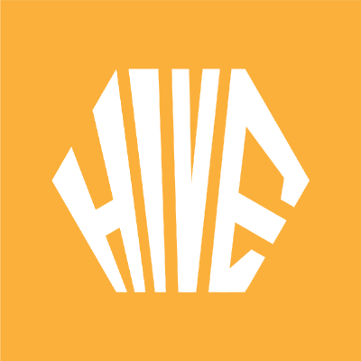
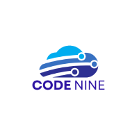

<h1>Olá, sou a Júlia! 🌷</h1>
<h2 href="#sumário">🌸 Sumário</h2>

🟪 <a href="#sobre-mim">Sobre mim</a>

🟪 <a href="#meus-projetos">Meus Projetos</a>

<ul><a href="#rimdoamor">1º Semestre • 2/2022 • Rim do Amor </a>
  

    <summary">Detalhes

    <ul>🟪 <a href="#tecnologias-utilizadas">Tecnologias Utilizadas</a></ul>
    <ul>🟪 <a href="#contribuições-pessoais">Contribuições Pessoais</a></ul>
    <ul>🟪 <a href="#lições-aprendidas">Lições Aprendidas</a>
    <ul>🟪 <a href="#hard-skills">Hard Skills</a></ul>
    <ul>🟪 <a href="#soft-skills">Soft Skills</a></ul>
    </ul>
  

</ul>

<ul><a href="#gestao">2º Semestre • 1/2023 • Gestão de Chamadas de Serviços </a>
  

    
Detalhes

    <ul>🟪 <a href="#tecnologias-utilizadas-">Tecnologias Utilizadas</a></ul>
    <ul>🟪 <a href="#contribuições-pessoais-">Contribuições Pessoais</a></ul>
    <ul>🟪 <a href="#lições-aprendidas-">Lições Aprendidas</a>
    <ul>🟪 <a href="#hard-skills-">Hard Skills</a></ul>
    <ul>🟪 <a href="#soft-skills-">Soft Skills</a></ul>
    </ul>
  

</ul>

<ul><a href="#sync">3º Semestre • 2/2023 • Portal de Transparência FAPG</a>
  

    
Detalhes

    <ul>🟪 <a href="#tecnologias-utilizadas--">Tecnologias Utilizadas</a></ul>
    <ul>🟪 <a href="#contribuições-pessoais--">Contribuições Pessoais</a></ul>
    <ul>🟪 <a href="#lições-aprendidas--">Lições Aprendidas</a>
    <ul>🟪 <a href="#hard-skills--">Hard Skills</a></ul>
    <ul>🟪 <a href="#soft-skills--">Soft Skills</a></ul>
    </ul>
  

</ul>

<h2>🌸 Sobre mim</h2>

Sou a Júlia, tenho 22 anos e sou estudante do terceiro semestre de Desenvolvimento de Software Multiplataforma na Fatec São José dos Campos. Atualmente estagiando na dbsnOOp como Desenvolvedora FullStack, aonde tenho aplicado meus conhecimento da faculdade em um verdadeiro ambiente de trabalho!

<a href="https://www.linkedin.com/in/j%C3%BAlia-rosado/">LinkedIn</a> ♥ <a href="https://github.com/juliamariahr">GitHub</a>

<h2>🌸 Meus Projetos</h2>

<h3 id="rimdoamor">⭐️ Rim do Amor</h3>
<h4>1º Semestre • 2/2023 • <a href="https://github.com/TeamHiveAPI/API-2023.2">Repositório Github e Documentação do Projeto</a></h4>

Parceiro Acadêmico: <a href="https://fatecsjc-prd.azurewebsites.net/">Faculdade de Tecnologia de São José dos Campos</a> (projeto interno)

</img>

O objetivo do projeto foi conscientizar a população brasileira sobre as dificuldades enfrentadas pelos pais de crianças com Doença Renal Crônica (DRC) e fornecer recursos para que esses pais encontrem hospitais especializados e informações sobre o tratamento disponível no Brasil.

Utilizamos o modelo MVC para construir uma aplicação em Flask para resolver este problema proposto pelo nosso cliente, onde utilizamos os conhecimentos aprendidos durante as matérias do primeiro semestre, neste projeto tínhamos um Administrador, que controlava as postagens e usuários normais, e esses usuários normais podiam publicar postagens do blog e também visualizar postagens de outros usuários.

  
<b>Funcionalidades</b>

  <ul>
    <li>Usuário: As mães podiam criar contas e criar publicações com imagens sobre as vivências e dificuldades da Doença Renal Crônica de seus filhos.</li>
    <li>Administrador: Recebem as postagens para aprovação antes de serem publicadas no blog, e também pode excluir usuários que infrinjam regras.</li>
    <li>Blog: Mostra histórias sobre os pais de crianças com IRC. Aonde são feitas postagens sobre as vivências e dificuldades da Doença Renal Crônica de seus filhos.</li>
    <li>Dados: Mostra dados verídicos e pertinentes sobre o tema para o usuário.</li>
  </ul>

<h3 id="tecnologias-utilizadas">Tecnologias Utilizadas</h3>

<a href="https://www.figma.com/">Figma:</a> para o desenvolvimento e prototipação das wireframes.

<a href="https://www.w3.org/standards/">HTML, CSS e JS:</a> para o desenvolvimento da página web e estilização.

<a href="https://flask.palletsprojects.com/en/3.0.x/">Python e Flask:</a> para a construção da lógica e requisitos solicitados pelo nosso cliente.

<a href="https://www.mysql.com/">MySQL:</a> como SGBD do nosso projeto.

<h3 id="contribuições-pessoais">Contribuições Pessoais</h3>
<ul>
  <li>Scrum Master: Facilitei a implementação da metodologia ágil Scrum por meio da organização de sprints, condução de reuniões diárias e eliminação de impedimentos para a equipe, assegurando entregas eficientes e em conformidade com os requisitos do projeto.</li>
  <li>Postagens no blog: Implementação da lógica de negócios utilizando Python e Flask, desenvolvendo a funcionalidade postagens no blog.</li>
  <li>Controle do site: Estabelecimento de permissões no site para diferentes perfis de usuários.</li>
  <li>Edição de Perfil: Fiz com que fosse possível adicionar e remover fotos de perfil.</li>
</ul>
<h3 id="lições-aprendidas">Lições Aprendidas</h3>

Aprendi várias tecnologias e metodologias novas, mas, acima de tudo, desenvolvemos Soft Skills essenciais para nos mantermos firmes na faculdade. A comunicação se mostrou fundamental em um projeto que durou meses. Apesar do desafio de formar um grupo onde ninguém dominava as tecnologias e ninguém se conhecia, foi uma experiência extremamente enriquecedora para todas nós conseguirmos concluir o projeto com um ótimo desempenho.

<h3 id="hard-skills">Hard Skills</h3>

  
<b>Clique para ver a lista de hard skills</b>

<table align="center">
  <tr>
    <th width="300px">Tecnologia/Metodologia</th>
    <th width="300px">Classificação</th>
  </tr>
  <tr>
    <td>Figma</td>
    <td>★★★★☆☆☆☆☆☆</td>
  </tr>
  <tr>
    <td>HTML</td>
    <td>★★★★★★★★★☆</td>
  </tr>
  <tr>
    <td>CSS e Bootstrap</td>
    <td>★★★★★★★☆☆☆</td>
  </tr>
  <tr>
    <td>JavaScript</td>
    <td>★★★★★★★☆☆☆</td>
  </tr>
  <tr>
    <td>Python e Flask</td>
    <td>★★★★★★★★☆☆</td>
  </tr>
  <tr>
    <td>MySQL</td>
    <td>★★★★★★★★★★</td>
  </tr>
</table>

<h3 id="soft-skills">Soft Skills</h3>

<b>Clique para ver a lista de soft skills</b>

  <table align="center">
    <tr>
      <th width="300px">Habilidade</th>
      <th width="300px">Classificação</th>
    </tr>
    <tr>
      <td>Proatividade</td>
      <td>★★★★★★★★☆☆</td>
    </tr>
    <tr>
      <td>Visão de Negócio</td>
      <td>★★★★★★★☆☆☆</td>
    </tr>
    <tr>
      <td>Comunicação Assertiva</td>
      <td>★★★★★★★★☆☆</td>
    </tr>
    <tr>
      <td>Empatia</td>
      <td>★★★★★★★☆☆☆</td>
    </tr>
    <tr>
      <td>Inteligência Emocional</td>
      <td>★★★★★★★★★★</td>
    </tr>
    <tr>
      <td>Organização e Planejamento</td>
      <td>★★★★★★★☆☆☆</td>
    </tr>
    <tr>
      <td>Resiliência</td>
      <td>★★★★★★★★☆☆</td>
    </tr>
  </table>

<b>Proatividade: </b>No começo da faculdade, estava super animada, mas sabia muito pouco sobre as tecnologias e metodologias ao meu redor. Mesmo assim, minha vontade de aprender era enorme! Acredito que foi o semestre em que mais me esforcei para me comunicar melhor com minhas colegas e fui bastante proativa para garantir que entregássemos um bom MVP. Apesar de não ter experiência com o método SCRUM, conseguimos nos adaptar bem ao longo das quatro sprints.

<a href="#sumário">Voltar para o início</a>

<h3 id="gestao">⭐️ Gestão de Chamadas de Serviços</h3>
<h4>2º Semestre • 1/2024 • <a href="https://github.com/Code-Nine-FTC/API-2024.1">Repositório Github e Documentação do Projeto</a></h4>

Parceiro Acadêmico: <a href="https://fatecsjc-prd.azurewebsites.net/">Faculdade de Tecnologia de São José dos Campos</a> (projeto interno)

</img>

Foi desenvolvido um sistema de gestão de chamadas de serviços, com foco no planejamento, acompanhamento e controle de atendimento.

O sistema contava com diferentes perfis de usuários, incluindo Administrador, Suporte e Cliente, cada um com permissões específicas. Essa estrutura permitiu gerenciar de forma eficiente os chamados de serviço, desde o registro até a resolução, assegurando que as necessidades dos usuários fossem atendidas.

Para o desenvolvimento, utilizamos tecnologias consolidadas no mercado, como JavaScript, TypeScript, Node.js e MySQL, seguindo a arquitetura MVC para organizar de forma estruturada as camadas da aplicação.

  
<b>Funcionalidades</b>

  <ul>
    <li>Administrador: Gerenciava todos os aspectos do sistema, incluindo a criação, edição e exclusão de usuários, além de acompanhar o status das chamadas e garantir o cumprimento dos SLA (Acordos de Nível de Serviço).</li>
    <li>Suporte: Atualizava o status das chamadas de serviço, categorizando-as como Aberto, Em processo ou Finalizado, e registrava soluções para problemas recorrentes.</li>
    <li>Cliente: Podia registrar novas chamadas de serviço, especificando detalhes como o tipo de atendimento solicitado, a descrição do problema e o nível de prioridade.</li>
  </ul>

<h3 id="tecnologias-utilizadas-">Tecnologias Utilizadas</h3>

<a href="https://www.mysql.com/">MySQL:</a> como SGBD do sistema, garantindo armazenamento e manipulação eficiente dos dados.

<a href="https://nodejs.org/en">JavaScript, TypeScript e Node.js:</a> para a implementação da lógica de negócios e dos requisitos do sistema.

<a href="https://react.dev/">React:</a> para a criação da interface do usuário, proporcionando uma experiência dinâmica e intuitiva.

<a href="https://developer.mozilla.org/en-US/docs/Web/CSS">CSS:</a> para a estilização e apresentação visual das páginas web.

<h3 id="contribuições-pessoais-">Contribuições Pessoais</h3>
<ul>
  <li>Monitoramento de status de chamados (Aberto, Em processo, Finalizado) e registro de soluções para problemas recorrentes</li>
  <li>Desenvolvimento de funcionalidades para gerenciamento de registros detalhados e alocação de recursos.</li>
  <li>Implementação de acordos de nível de serviço (SLA) para garantir qualidade e prazos de atendimento.</li>
</ul>
<h3 id="lições-aprendidas-">Lições Aprendidas</h3>

Desenvolver o sistema de gestão de chamadas de serviços foi uma experiência extremamente enriquecedora. Durante o projeto, tive a oportunidade de aprimorar minhas habilidades no backend, aprofundando meus conhecimentos em lógica de negócios, banco de dados relacional e implementação de APIs. Além disso, contar com um time colaborativo e um Scrum Master dedicado foi essencial para o sucesso do projeto. O uso do framework Scrum nos ajudou a organizar o trabalho de forma eficiente, promovendo alinhamento e entregas constantes, o que me permitiu aprender não só tecnicamente, mas também sobre trabalho em equipe e comunicação.

<h3 id="hard-skills-">Hard Skills</h3>

  
<b>Clique para ver a lista de hard skills</b>

  <table align="center">
    <tr>
      <th width="300px">Tecnologia/Metodologia</th>
      <th width="300px">Classificação</th>
    </tr>
    <tr>
      <td>React</td>
      <td>★★★★★☆☆☆☆☆</td>
    </tr>
    <tr>
      <td>JavaScript, Typescript e Node</td>
      <td>★★★★★★★★★☆</td>
    </tr>
    <tr>
    <td>CSS</td>
    <td>★★★★★★☆☆☆☆</td>
    </tr>
    <tr>
      <td>MySQL</td>
      <td>★★★★★★★★★☆</td>
    </tr>
  </table>

<h3 id="soft-skills-">Soft Skills</h3>

<b>Clique para ver a lista de soft skills</b>

  <table align="center">
    <tr>
      <th width="300px">Habilidade</th>
      <th width="300px">Classificação</th>
    </tr>
    <tr>
      <td>Proatividade</td>
      <td>★★★★★★☆☆☆☆</td>
    </tr>
    <tr>
      <td>Visão de Negócio</td>
      <td>★★★★★★★☆☆☆</td>
    </tr>
    <tr>
      <td>Comunicação Assertiva</td>
      <td>★★★★★★★★☆☆</td>
    </tr>
    <tr>
      <td>Empatia</td>
      <td>★★★★★★★★★★</td>
    </tr>
    <tr>
      <td>Inteligência Emocional</td>
      <td>★★★★★★★★☆☆</td>
    </tr>
    <tr>
      <td>Organização e Planejamento</td>
      <td>★★★★★★★★☆☆</td>
    </tr>
    <tr>
      <td>Resiliência</td>
      <td>★★★★★★★★☆☆</td>
    </tr>
  </table>

Nesse semestre, a <b>visão de negócio</b> em conjunto com a <b>proatividade</b> nos levou a alcançar um resultado bem interessante, onde podíamos ver que o trabalho realizado no primeiro semestre havia nos ensinado bastante, mas ainda tínhamos muito o que aprender, principalmente ao lidar com a organização de pessoas, tivemos um projeto bem mais sólido e conseguimos aprender um conjunto de ferramentas bem variadas e cumprimos com todos os prazos estabelecidos pelo cliente.

<a href="#sumário">Voltar para o início</a>

<h3 id="sync">⭐️ Portal de Transparência FAPG</h3>
<h4>3º Semestre • 2/2024 • <a href="https://github.com/Sync-FATEC/API-2024.2-3SEM">Repositório Github e Documentação do Projeto</a></h4>

Parceiro Acadêmico: <a href="https://fapg.org.br/">FAPG</a>

</img>

O desenvolvimento da solução para o Portal de Transparência da Fundação tem como objetivo garantir a transparência das informações dos projetos realizados, atendendo às exigências legais. Apresentamos uma plataforma que permite a inserção de dados de projetos, consulta de informações e a geração de relatórios e dashboards. O sistema foi projetado para ser fácil de usar, garantindo a organização e o acesso a informações de forma eficiente e segura.

  
<b>Funcionalidades</b>

  <ul>
    <li>Importação de Dados: A ferramenta permite a migração de dados da aplicação legada para o novo banco de dados, garantindo a continuidade das informações já registradas.</li>
    <li>Cadastro de Projetos: Oferece uma interface intuitiva para o cadastro de novos projetos, facilitando o processo de inclusão de dados relevantes como título, datas, coordenadores e documentos.</li>
    <li>Pesquisa de Projetos: Interface de pesquisa robusta, permitindo filtrar e visualizar projetos com base em diferentes critérios como status, data de início, classificação e mais.</li>
    <li>Cadastro de Usuários: Facilita o cadastro de novos usuários e o gerenciamento de permissões, permitindo níveis de acesso diferenciados.</li>
    <li>Relatórios e Dashboards: Geração de relatórios e dashboards com filtros específicos para visualizar o andamento dos projetos e o cumprimento das obrigações de transparência.</li>
  </ul>

<h3 id="tecnologias-utilizadas--">Tecnologias Utilizadas</h3>

<a href="https://react.dev/">React:</a> para o desenvolvimento da interface do usuário, criando uma experiência dinâmica e interativa.

<a href="https://spring.io/projects/spring-boot">Spring Boot (Java):</a> para a construção da lógica de backend, atendendo aos requisitos técnicos e de integração do sistema.

<a href="https://www.python.org/">Python:</a> utilizado para realizar algumas integrações específicas e automações no backend.

<a href="https://www.mysql.com/">MySQL:</a> como SGBD para armazenar e gerenciar os dados dos projetos e usuários de forma eficiente.

<h3 id="contribuições-pessoais--">Contribuições Pessoais</h3>
<ul>
  <li>Desenvolvimento da lógica de importação de dados para dashboard de empresas, garantindo a integridade e continuidade das informações.</li>
  <li>Criação de dashboards e relatórios interativos para o acompanhamento do progresso das empresas.</li>
  <li>Desenvolvimento da interface de pesquisa de bolsas e bolsistas, com filtros flexíveis para facilitar a busca e visualização das informações.</li>
</ul>
<h3 id="lições-aprendidas--">Lições Aprendidas</h3>

Durante o desenvolvimento do Portal de Transparência, aprendi a importância crucial da comunicação clara com a equipe. No entanto, o início do projeto foi extremamente estressante devido a problemas de comunicação e organização no grupo original. A falta de alinhamento gerava constantes retrabalhos, atrasos e conflitos, tornando o ambiente desgastante e desmotivador. O nível de estresse foi tão elevado que o grupo acabou sendo dissolvido, e cada integrante foi redistribuído para equipes diferentes.
Embora essa situação tenha sido exaustiva, a troca de equipe trouxe um alívio imediato. O novo grupo tinha uma dinâmica muito mais colaborativa e organizada, permitindo que o trabalho fluísse de maneira mais tranquila e produtiva. A experiência de trabalhar com uma equipe multidisciplinar e com prazos apertados me permitiu aprimorar minha capacidade de gerenciar expectativas e me adaptar rapidamente às mudanças de requisitos. Além disso, o apoio constante do novo time e do Scrum Master foi essencial para superar os desafios e entregar o projeto com qualidade, apesar do início conturbado.

<h3 id="hard-skills--">Hard Skills</h3>

  
<b>Clique para ver a lista de hard skills</b>

  <table align="center">
    <tr>
      <th width="300px">Tecnologia/Metodologia</th>
      <th width="300px">Classificação</th>
    </tr>
    <tr>
    <tr>
      <td>React</td>
      <td>★★★★★★★★★☆</td>
    </tr>
    <tr>
      <td>Java e Spring Boot</td>
      <td>★★★★★★★★★★</td>
    </tr>
    <tr>
    <td>Python</td>
    <td>★★★★★★★★★★</td>
    </tr>
    <tr>
      <td>MySQL</td>
      <td>★★★★★★★★★★</td>
    </tr>
  </table>

<h3 id="soft-skills--">Soft Skills</h3>

<b>Clique para ver a lista de soft skills</b>

  <table align="center">
    <tr>
      <th width="300px">Habilidade</th>
      <th width="300px">Classificação</th>
    </tr>
    <tr>
      <td>Proatividade</td>
      <td>★★★★★★★☆☆☆</td>
    </tr>
    <tr>
      <td>Visão de Negócio</td>
      <td>★★★★★★★☆☆☆</td>
    </tr>
    <tr>
      <td>Comunicação Assertiva</td>
      <td>★★★★★★☆☆☆☆</td>
    </tr>
    <tr>
      <td>Empatia</td>
      <td>★★★★★★★★★★</td>
    </tr>
    <tr>
      <td>Inteligência Emocional</td>
      <td>★★★★★★★☆☆☆</td>
    </tr>
    <tr>
      <td>Organização e Planejamento</td>
      <td>★★★★★★☆☆☆☆</td>
    </tr>
    <tr>
      <td>Resiliência</td>
      <td>★★★★★★★★☆☆</td>
    </tr>
  </table>

<b>Organização e Planejamento:</b> Aprendi a priorizar tarefas, dividir o trabalho de forma eficiente e gerenciar meu tempo, garantindo entregas de qualidade mesmo sob alta demanda.  

<b>Gestão de Conflitos e Adaptação:</b> Superar o estresse de um grupo desorganizado me ensinou a lidar com conflitos, me adaptar a mudanças e manter o foco em situações adversas.  

<b>Colaboração e Comunicação:</b> A troca de equipe reforçou a importância da comunicação clara e do trabalho colaborativo para o sucesso de um projeto.  

<b>Gerenciamento Emocional:</b> Desenvolvi resiliência e estratégias para lidar com a pressão, mantendo minha produtividade em cenários desafiadores.

<a href="#sumário">Voltar para o início</a>

